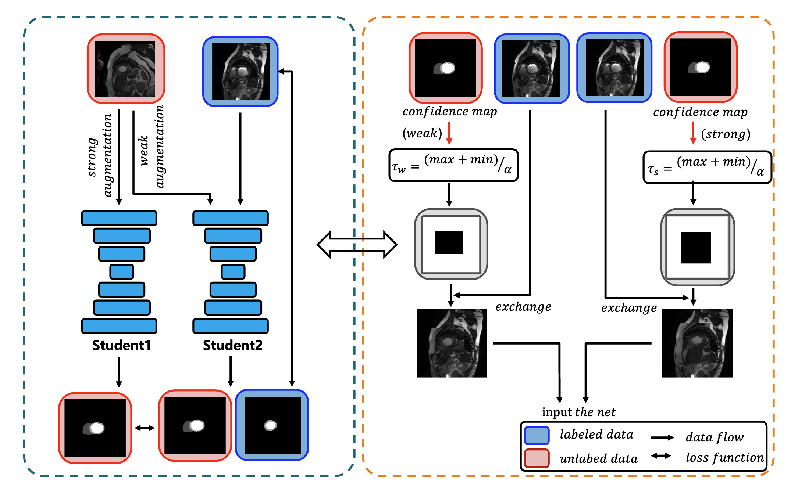
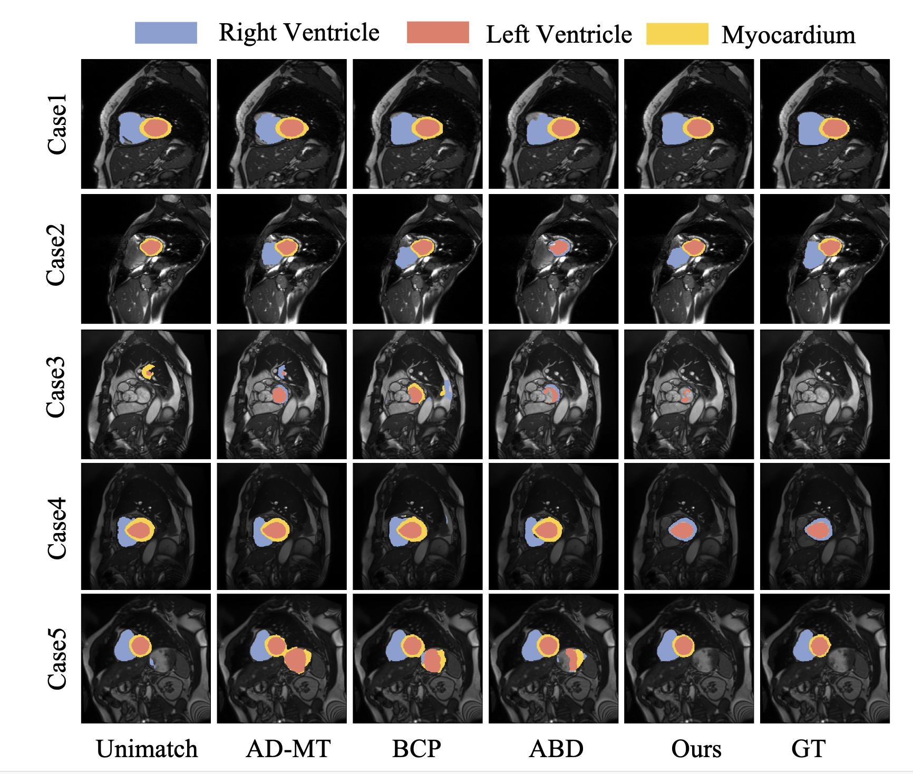

# AdaMix:Adaptive CutMix Strategy for Semi-Supervised Medical Image Segmentation with Confidence-Based Region Exchange
## Our frame:
{width=500}

## About our code
### DataSet
Data could be got at *[ACDC](https://github.com/HiLab-git/SSL4MIS/tree/master/data/ACDC)* and *[promise12](https://promise12.grand-challenge.org/Download/)*.

### Run
```
python train_ACDC_AdaMix.py
python train_promise12_AdaMix.py
```
### Outcome
Our results are as follows:
#### ACDC
| Method       | Year       | \#Lab.  | DSC↑     | mIoU↑   | 95HD↓   | ASD↓    |
|--------------|------------|----------|----------|---------|---------|---------|
| U-Net        |            | 3 (5%)   | 47.83    | 37.01   | 31.16   | 12.62   |
| U-Net        |            | 7 (10%)  | 79.41    | 68.11   | 9.35    | 2.70    |
| U-Net        |            | 70 (All) | 91.44    | 84.59   | 4.30    | 0.99    |
| UA-MT        | MICCAI'19  | 3 (5%)   | 46.04    | 35.97   | 20.08   | 7.75    |
| SASSNet      | MICCAI'20  |          | 57.77    | 46.14   | 20.05   | 6.06    |
| DTC          | AAAI'21    |          | 56.90    | 45.67   | 23.36   | 7.39    |
| MC-Net       | MICCAI'21  |          | 62.85    | 52.29   | 7.62    | 2.33    |
| URPC         | MedIA'22   |          | 55.87    | 44.64   | 13.60   | 3.74    |
| SS-Net       | MICCAI'22  |          | 65.82    | 55.38   | 6.67    | 2.28    |
| DMD          | MICCAI'23  |          | 80.60    | 69.08   | 5.96    | 1.90    |
| UniMatch     | CVPR'23    |          | 84.38    | 75.54   | 5.06    | 1.04    |
| BCP          | CVPR'23    |          | 87.59    | 78.67   | 1.90    | 0.67    |
| CPC-SAM      | MICCAI'24  |          | 87.95    | 79.01   | 5.80    | 1.54    |
| AD-MT        | ECCV'24    |          | 88.75    | 80.41   | 1.48    | 0.50    |
| ABD          | CVPR'24    |          | 88.96    | 80.70   | 1.57    | 0.52    |
| **Ours**     |            |          | **89.86**| **82.19**| **1.38**| **0.37**|
| UA-MT        | MICCAI'19  | 7 (10%)  | 81.65    | 70.64   | 6.88    | 2.02    |
| SASSNet      | MICCAI'20  |          | 84.50    | 74.34   | 5.42    | 1.86    |
| DTC          | AAAI'21    |          | 84.29    | 73.92   | 12.81   | 4.01    |
| MC-Net       | MICCAI'21  |          | 86.44    | 77.04   | 5.50    | 1.84    |
| URPC         | MedIA'22   |          | 83.10    | 72.41   | 4.84    | 1.53    |
| SS-Net       | MICCAI'22  |          | 86.78    | 77.67   | 6.07    | 1.40    |
| DMD          | MICCAI'23  |          | 87.52    | 78.62   | 4.81    | 1.60    |
| UniMatch     | CVPR'23    |          | 88.08    | 80.10   | 2.09    | 0.45    |
| BCP          | CVPR'23    |          | 88.84    | 80.62   | 3.98    | 1.17    |
| MOST         | MICCAI'24  |          | 89.29    | 81.23   | 3.28    | 0.98    |
| AD-MT        | ECCV'24    |          | 89.46    | 81.47   | 1.51    | **0.44**    |
| ABD          | CVPR'24    |          | 89.81    | 81.95   | **1.46**    | 0.49    |
| **Ours**     |            |          | **90.85**| **83.70**| 1.63| 0.59|


{width=500}

#### PROMISE12
| Method                 | Reference         | #Labeled   | #Unlabeled | DSC↑    | ASD↓    |
|------------------------|-------------------|------------|------------|---------|---------|
| U-Net                 |                   | 7 (20%)    | 0          | 60.88   | 13.87   |
| U-Net                 |                   | 35 (All)   | 0          | 84.76   | 1.58    |
| CCT | (CVPR'20)        | 7 (20%)    | 28 (80%)   | 71.43   | 16.61   |
| URPC      | (MedIA'22)       | 7 (20%)    | 28 (80%)   | 63.23   | 4.33    |
| SS-Net    | (MICCAI'22)      | 7 (20%)    | 28 (80%)   | 62.31   | 4.36    |
| SLC-Net | (MICCAI'22)    | 7 (20%)    | 28 (80%)   | 68.31   | 4.69    |
| SCP-Net | (CVPR'23) | 7 (20%)    | 28 (80%)   | 77.06   | 3.52    |
| ABD| (CVPR'24)     | 7 (20%)    | 28 (80%)   | 82.06   | 1.33    |
| **Ours**              |                   | 7 (20%)    | 28 (80%)   | **82.78** | **1.12** |
| ABD| (CVPR'24)     | 3 (10%)    | 32 (90%)   | 81.81   | 1.46    |
| **Ours**              |                   | 3 (10%)    | 32 (90%)   | **82.13** | **1.09** |


## Acknowledgement
We extend our heartfelt gratitude to *[ABD](https://github.com/chy-upc/ABD)* for providing the code, which has been invaluable to our work.

